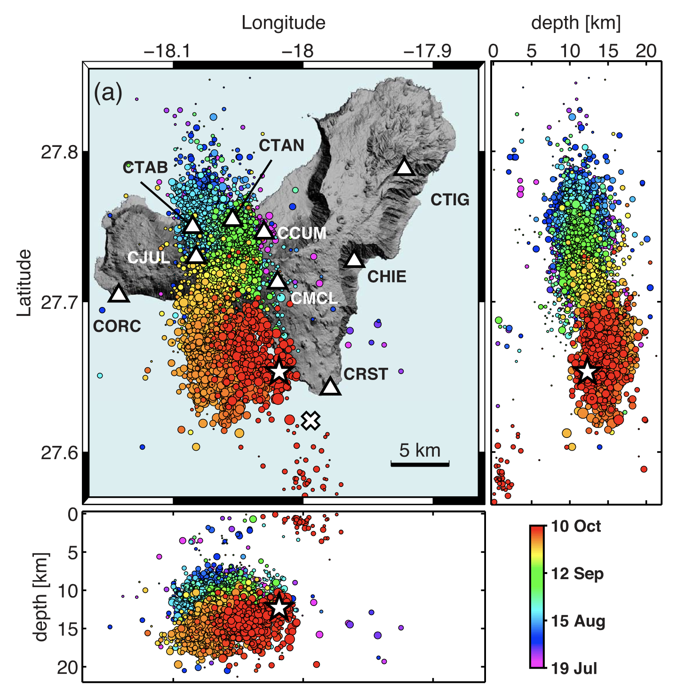

## El Hierro

We use a dataset of locations and P- and S-wave arrival times from earthquakes 
preceeding the eruption of 2011-2012.

The dataset begins on 2011-07-21 and ends on 2011-10-09 (beginning of the eruption).
It contains 31,641 earthquakes and has been obtained by reprocessing the original IGN data
(Eduardo Díaz Suárez, eadiaz@mitma.es, personal communication).

The following figure shows the distribution of the pre-eruption seismicity, and the location of
the seismic stations from the IGN network (López et al., 2012).

López, C., Blanco, M. J., Abella, R., et al. (2012). Monitoring the volcanic
unrest of El Hierro (Canary Islands) before the onset of the 2011–2012 submarine
eruption. Geophysical Research Letters, 39(13), L13303,
doi:[10.1029/2012GL051846](https://agupubs.onlinelibrary.wiley.com/doi/full/10.1029/2012GL051846).
